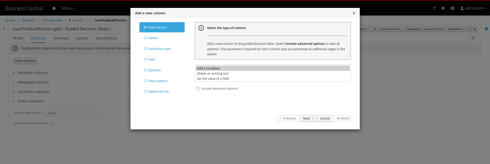
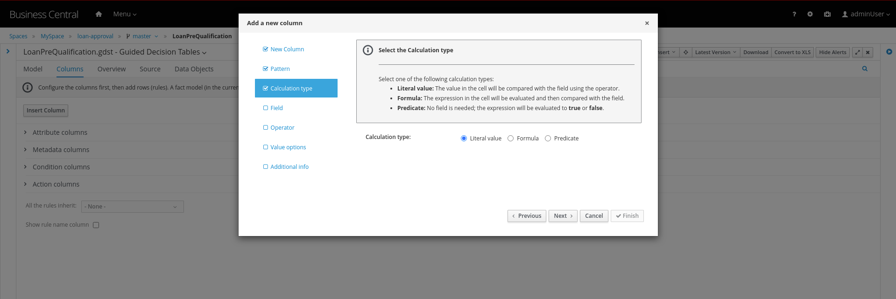

# 5. Creating the Pre-Qualification Decision

First let us create a simple Pre Qualification decision.

We will use the *Guided Decision Table* asset.

> 1. Guided Decison are rules that you create in a UI-based table designer in Decision Central
> 2. Are a wizard-led alternative to uploaded decision table spreadsheets
> 3. Provide fields and options for acceptable input

1. Now go back to the asset library and click on *Add Asset* button. Choose the Guided Decision Table option.

   

   Guided Decision tables provide wizard based approach to defining condition and action columns.

   On the Guided Decision Table editor click on the Columns Tab.

   

2. To Add a condition colum click on the *Insert Column* button. This will open up the wizard. Choose the *Add a Condition* option and click on *Next*

   

   First we need to import the data objects which we will be using for the rule. For this click on the *Create a new Fact Pattern* button.

   Choose the `LoanApplicant` type and provide a binding variable. This is required so that we can start defining condition and action columns based on the *LoanApplicant* object.

   

   Next let us define the Calculation type, we will choose the *Literal Value* and proceed.

   

   We will choose the `age` field.

   

   Since we need to define the Min age check, we will choose the operation as `greater than` and proceed.

   

   Finally we will give the column a header name and save the column definition.

   

3. Next we will define the Max Age column, repeat the same steps as above but choose the operation type as `less than` instead. We will name this `Age < Than`

   

4. Next let us define the Credit Score.

   For this click on `Insert Column`, choose the `loanApplicant` fact pattern, and choose the calculation type as `Literal value` column name as `creditScore`

   

   We will choose the operator as `greater than`, proceed on to provide a header name and save.

   

5. Next we will define the check for `loanAmount`. For this click on `Insert Column`, choose the `loanApplicant` fact pattern, and choose the calculation type as `Literal value` column name as `loanAmount` We will choose the operator as `less than`, proceed on to provide a header name and save.

   

6. Finally let us create a column for `residency`. For this click on `Insert Column`, choose the `loanApplicant` fact pattern, and choose the calculation type as `Literal value` column name as `residency` We will choose the operator as `equal to`, proceed on to provide a header name and save.

   

7. Now we will define the action column. For this click on `Insert Column`. Choose the option for `Set the value of field` and click next.

   

   Choose the fact pattern `loanApplicant` and proceed. Choose the `Field` as `loanPreQualification`.

   

   Finally add a header for the column and save.

## Adding a RuleFlow Group

1. Now, we will add an Attribute column to the table. This will help us define the Rule flow group for this rule. Rule flow Group provides a mechanism for grouping and executing rules. We will use this grouping on our process to indicate which rule to execute.

   For this click on the `Insert Column` button. Check the box for `Include advanced options` and choose `Add an Attribute column` option.

   

   Choose the `Ruleflow-Group` option.

   

   Now expand the `Attribute columns` section as shown below. Enter the `Default Value` as `loanPreQualification` and check the box to hide the column.

   

## Creating the business rules 

1. Now switch back to the `Model` Tab, you can see the following table setup.

   Let us now fill up the table with values as below. For this choose the `Insert` button.

   

   

   If you need to remove any of the cell values which you might have wrongly entered, right click on the cell and click on `Delete Cell`. If you need delete the whole row, select the row and right click to `Delete row(s)`

