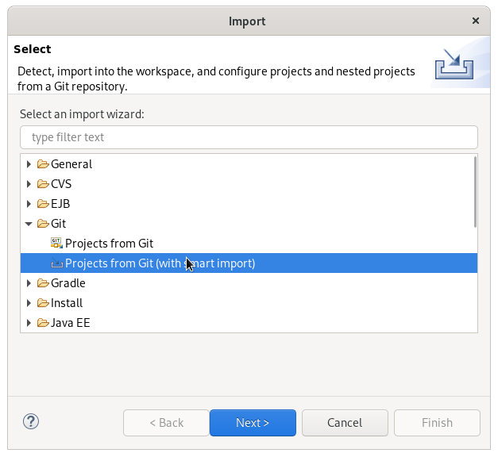
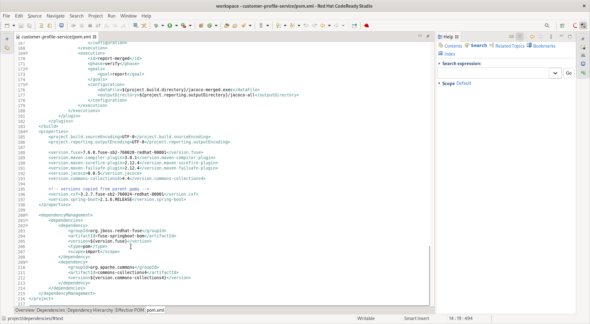
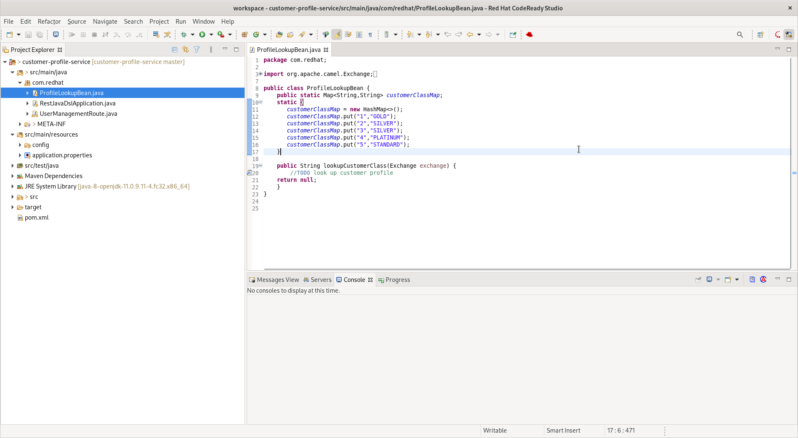

### 7. Creating the Customer Profile Lookup Service

Now let us create a simple Fuse service to lookup customer profile information. The service will lookup the Customer Class based on the Customer id. We will use [Red Hat Developer Studio](https://developers.redhat.com/products/codeready-studio/download?extIdCarryOver=true&sc_cid=7013a000002goGYAAY) to create this service.

1. Launch the developer studio from the installed location.

2. We will start with a base project for creating the service. For this we will import the project from git.

   

   ]

   We will clone URI from the location

   ```
   https://github.com/snandakumar87/customer-profile-service
   ```

   ]

   Follow along the wizard with the default values and the project should start to load up.

3. You will notice that the project is a simple maven project with spring and Fuse dependencies. Open up the pom.xml to check out the dependencies which have been added. We use the BOM for spring and Fuse so that the right libraries for the specified version is pulled in.

   

4. Next let us explore the project structure. The source files can be found under /src/main/java. RestJavaDslApplication is a simple Spring boot Application class. We will use a simple helper class that enables us to lookup customer class from a data source. In this example, for the sake of simplicity we will assume it from a local hashmap. Open up the ProfileLookupBean.java

   ]

   Notice that we have loaded up a sample hashmap with customer class for 5 users. In the section marked `//TODO lookup customer profile` define the following.

   ```
   String custId = (String) exchange.getIn().getHeader("custId");
   return customerClassMap.get(custId);
   ```

   Make sure to remove null return from the skeleton implementation. Now that we have a helper class to look up the data, let us now define the integration route.

5. The UserManagementRoute will be route definition file for defining the integration. Routes contain the flow and logic of integration between different systems. In order to define routes more easy and clean, Camel offers several different domain-specific languages (DSL) for programming languages like Java. Open up this clas.

   

   Notice that the skeleton for the Route has been created. We will now define the route to expose a rest service, which will accept a customer id over a `GET` class and invoke the helper bean to get the customer call. Copy paste the following code snippet in the section marked `//TODO`

   ```
   rest("/lookup/{custId}")
             .bindingMode(RestBindingMode.json)
             .get()
             .produces(MediaType.APPLICATION_JSON_VALUE)
             .route()
             .bean(ProfileLookupBean.class,"lookupCustomerClass")
             .endRest();
   ```

   Notice how the Java DSL provides a simple builder syntax for creating route definitions.

6. We are now all set to build and deploy the code. For this, open up the RestJavaDSLApplication.java class, right click and Run as Java Application.

   Now open up a browser with the url

   ```
   http://localhost:8087/camel-rest/lookup/2
   ```

   This should result in a response "SILVER". Next let us define our workflow.

### 