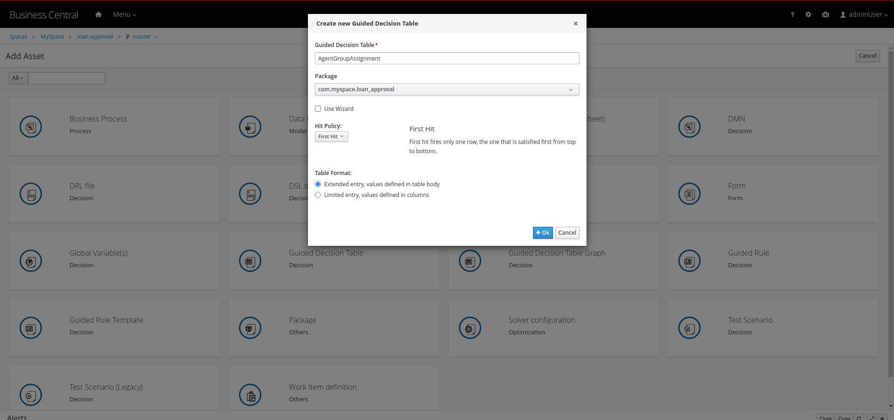
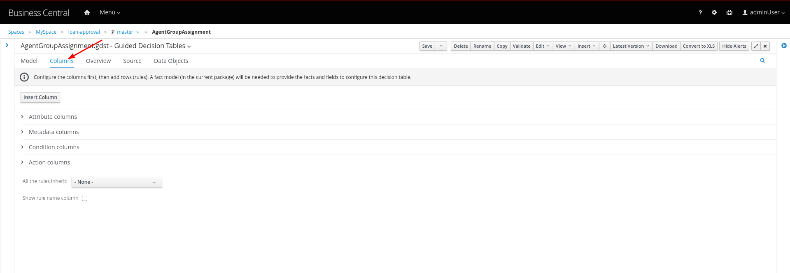
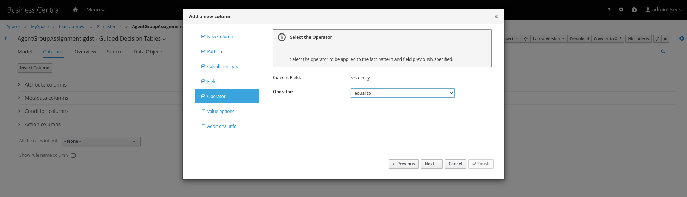

# 6. Creating the Group Assignment Decision

1. Now, we will create another Decision table to dynamically determine which agent group to assign the loan approval request to. For this go back to the asset library and click on *Add Asset* button. Choose the Guided Decision Table option.

   For this decision table, we will choose the `Hit Policy` as `First Hit`.

   

2. Now let us define the columns. For this click on the `Columns` tab.

   

3. Click on the `Insert Column` button, choose the option for `Add a condition` and click next. As we did earlier we will need to define a Fact pattern. For this click on `Create a new Fact Pattern`.

   

   Create the fact pattern as above and proceed. Choose `Calculation type` as `Literal value`. Choose the `Field` as `age` and click on next. We will define the column as `greater than` as shown below.

   Provide a header name for the column and click on save

4. Next let us create the next condition column. For this, click on `Insert Column`, choose the fact pattern we created in the earlier step, choose the `Calculation type` as `Literal value`. Choose the `Field` as `residency`. For this we will define the operator as `equals to`

   

5. Next let us define the `Action` column. For this click on `Insert Column` button, choose the option to `Set the value of a field`.

   

   Choose the Fact pattern which we created earlier, choose the `Field` as `loanGroupAssignment`. Provide a header name for the column and save changes.

6. Finally we will add an `Attribute` column for defining the Rule flow group. As we did with the previous decision table, click on `Insert Column`, choose the `Include advanced options` checkbox, and choose `Add an attribute column`.

   

   We will choose the Ruleflow-Group option.

   

   Expand the `Attribute Columns` and provide a default value for the `ruleflow-group` as below.

   

   The table should now look like this. Next we will click on the `Insert` button to fill up the table as below.

   [image 2020 09 01 13 42 52 175](images/image-2020-09-01-13-42-52-175.png)

   [

