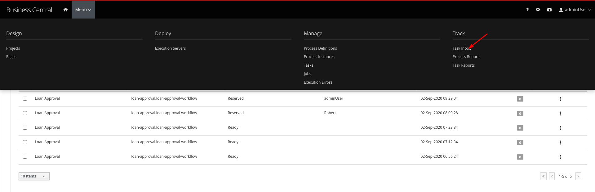

### 11. Task Inbox

1. Task Inbox shows up assigned tasks for the user. This perspective allows the user to work on a task. Lets now login as `adminUser`. Since we reassigned a task to that user, we should be able to see the task waiting on the inbox.

   Click on the top section and choose the `Task Inbox`.

   

   There should be a task waiting, open it up. As you can see the task form shows up.

   

   You can see that the details section allows for `Priority` to be changed. This can be used in a reassignment strategy if need be.

   Let us now switch back to the `Work` tab, and click on the `Start` button.

   

   Now you can see additional options to `Complete`. Click on `Complete`. The task should now get completed.